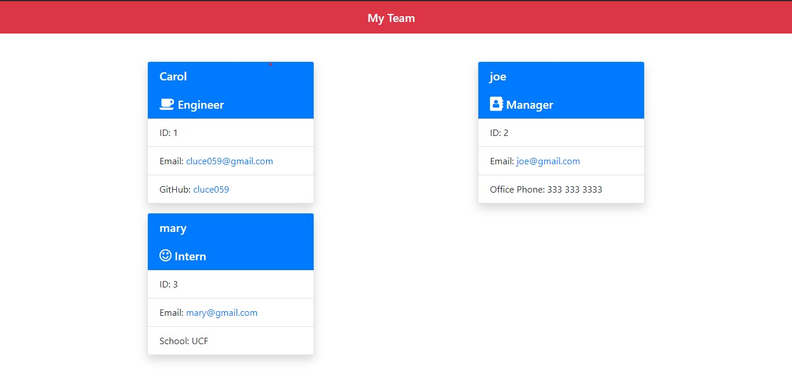

  ## Team Profile Generator
  
   
  ## Description
  🔍 A node.js application that allows users to easily create a profile of employees and their roles and respective attributes.
  ## Table of Contents
  - [Description](#description)
  - [Installation](#installation)
  - [Usage](#usage)
  - [License](#license)
  - [Contributing](#contributing)
  - [Tests](#tests)
  - [Questions](#questions)

  ## Installation
  💾 clone this repo, install node.js and npm packages inquirer FileSystem 
  ## Usage
  💻 Use to create a simple team profile using node.js prompts
  ## License
  
  
  This project was made with a/an __ license.
  
  ## Contributing
  😇 PR's welcome!
  ## Tests
  ❗  answer the prompts and insure that the correct data is rendered in your README.md
  ## Questions
  👽 email me! 
   
  :octocat: Find me on GitHub: [Cluce059](https://github.com/Cluce059) 
   

 ## Screenshot
  

  💬 Email: Cluce059@gmail.com  
  _This README was generated with ❤️ by [README-generator](https://github.com/Cluce059/readme-generator) 	👀👀👀_